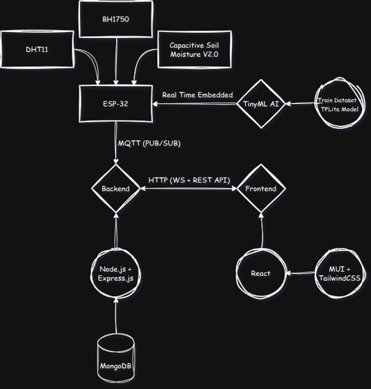

# 🌿 FloraSense - AI-Powered Smart Plant Monitoring System

[](LICENSE)
[](https://nodejs.org/)
[](https://reactjs.org/)
[](https://www.typescriptlang.org/)
[](https://www.mongodb.com/)
[](https://www.espressif.com/en/products/socs/esp32)
[](https://www.tensorflow.org/)

> **FloraSense** is a comprehensive IoT plant monitoring system that combines real-time sensor data collection, machine learning-powered plant health analysis, and an intuitive web dashboard. Perfect for both hobbyist gardeners and professional agricultural applications.

## 🚀 Key Features

### 🔍 **Real-Time Monitoring**

- **Multi-Sensor Support**: Temperature, humidity, soil moisture, and light intensity
- **Live Data Streaming**: WebSocket-based real-time updates
- **Historical Analytics**: Comprehensive data logging and trend analysis

### 🧠 **AI-Powered Intelligence**

- **Plant Health Prediction**: TensorFlow-based ML models for health assessment
- **Edge Computing**: TensorFlow Lite inference directly on ESP32 devices
- **Image Analysis**: Google Gemini AI integration for plant disease detection
- **Smart Alerts**: Automated notifications for plant care requirements

### 📊 **Advanced Dashboard**

- **Interactive Charts**: Real-time data visualization with Chart.js
- **Multi-Plant Management**: Monitor multiple plants simultaneously
- **Responsive Design**: Mobile-friendly interface with React and Material-UI
- **User Authentication**: Secure JWT-based authentication system

### 🔌 **IoT Integration**

- **MQTT Communication**: Efficient, reliable sensor data transmission
- **ESP32 Support**: Complete firmware for popular development boards
- **Plug-and-Play**: Easy sensor setup and configuration
- **Scalable Architecture**: Support for multiple sensor nodes

## 🏗️ System Architecture



## 🛠️ Technology Stack

### **Frontend**

- **Framework**: React 18+ with TypeScript
- **State Management**: Redux Toolkit with RTK Query
- **UI Components**: Material-UI (MUI) and custom components
- **Charts**: Chart.js with react-chartjs-2
- **Styling**: Emotion and styled-components
- **Build Tool**: Vite for fast development and building

### **Backend**

- **Runtime**: Node.js 18+ with Express.js
- **Database**: MongoDB with Mongoose ODM
- **Authentication**: JWT (JSON Web Tokens)
- **Real-time Communication**: Socket.IO for WebSocket connections
- **IoT Communication**: MQTT client for sensor data
- **Image Processing**: Multer for file uploads

### **IoT Hardware**

- **Microcontroller**: ESP32 (ESP32-WROOM-32)
- **Sensors**:
  - DHT22 (Temperature & Humidity)
  - Soil Moisture Sensor (Analog)
  - LDR/Photoresistor (Light Intensity)
- **ML Framework**: TensorFlow Lite for Microcontrollers
- **Communication**: WiFi and MQTT protocol

### **Machine Learning**

- **Framework**: TensorFlow 2.13+
- **Development**: Jupyter Notebooks for experimentation
- **Deployment**: TensorFlow Lite for edge inference
- **AI Integration**: Google Gemini API for image analysis
- **Data Processing**: pandas, numpy, scikit-learn

### **DevOps & Deployment**

- **Containerization**: Docker and Docker Compose

## 📦 Installation & Setup

### Prerequisites

Before you begin, ensure you have the following installed:

- **Node.js** 18.0 or higher
- **MongoDB** 6.0 or higher
- **Docker** (optional, for containerized deployment)
- **Python** 3.8+ (for ML development)
- **Arduino IDE** or **PlatformIO** (for IoT development)

### Quick Start with Docker

1. **Clone the repository**:

```bash
git clone https://github.com/your-username/flora-sense.git
cd flora-sense
```

2. **Start with Docker Compose**:

```bash
docker-compose up -d
```

This will start:

- Frontend on `http://localhost:5173`
- Backend API on `http://localhost:5000`
- MongoDB will be accessed via host network

### Manual Installation

#### 1. Backend Setup

```bash
cd server
npm install

# Copy environment configuration
cp .env.example .env
# Edit .env with your configurations:
# PORT=5000
# MONGO_URI=mongodb://localhost:27017/flora-sense
# MQTT_BROKER=mqtt://localhost:1883
# JWT_SECRET=your-super-secret-jwt-key
# JWT_EXPIRES_IN=7d

# Start the backend server
npm run dev
```

#### 2. Frontend Setup

```bash
cd client
npm install

# Copy environment configuration
cp .env.example .env
# Edit .env:
# REACT_APP_API_URL=http://localhost:5000/api

# Start the development server
npm run dev
```

#### 3. Database Setup

Make sure MongoDB is running locally:

```bash
# Start MongoDB service (varies by OS)
# macOS with Homebrew:
brew services start mongodb-community

# Ubuntu/Debian:
sudo systemctl start mongod

# Windows: Start MongoDB service from Services panel
```

### 🔧 IoT Setup

#### Hardware Requirements

- ESP32 development board
- DHT22 temperature/humidity sensor
- Soil moisture sensor
- Light-dependent resistor (LDR)
- Breadboard and jumper wires
- 10kΩ resistor (for LDR)

#### Wiring Diagram

```
ESP32           DHT22
-----           -----
3.3V     -->    VCC
GND      -->    GND
GPIO4    -->    DATA

ESP32           Soil Moisture
-----           -------------
3.3V     -->    VCC
GND      -->    GND
GPIO34   -->    A0

ESP32           LDR Circuit
-----           -----------
3.3V     -->    VCC
GND      -->    GND
GPIO21   -->    I2C_SDA
GPIO22   -->    I2C_SCL
```

#### Firmware Installation

1. **Install required libraries** in Arduino IDE or PlatformIO:

   - WiFi (built-in)
   - PubSubClient (for MQTT)
   - DHT sensor library
   - ArduinoJson
   - TensorFlowLite_ESP32

2. **Configure WiFi and MQTT** in `iot/include/env.h`:

```cpp
#define WIFI_SSID "your-wifi-name"
#define WIFI_PASSWORD "your-wifi-password"
#define MQTT_BROKER_IP "192.168.1.100"  // Your server IP
#define MQTT_BROKER_PORT 1883
#define DEVICE_ID "flora-sense-01"
```

3. **Upload the firmware**:

```bash
cd iot
# If using PlatformIO:
pio run --target upload

# If using Arduino IDE:
# Open iot/src/main.cpp and upload via IDE
```

### 🤖 Machine Learning Setup

#### Environment Setup

```bash
cd ml
pip install -r requirements.txt

# Start Jupyter for model development
jupyter notebook
```

#### Available Notebooks

1. **`01_data_exploration.ipynb`**: Explore sensor data patterns
2. **`02_data_preprocessing.ipynb`**: Clean and prepare training data
3. **`03_model_training.ipynb`**: Train plant health prediction models
4. **`04_model_evaluation.ipynb`**: Evaluate model performance
5. **`05_tensorflowlite_conversion.ipynb`**: Convert models for edge deployment

#### Model Training

```bash
# Generate training data (run sensors for data collection first)
python scripts/collect_training_data.py

# Train the plant health model
python scripts/train_model.py

# Convert to TensorFlow Lite for ESP32
python scripts/convert_to_tflite.py
```

## 🔌 API Documentation

### Authentication Endpoints

#### POST `/api/auth/register`

Register a new user account.

**Request Body:**

```json
{
  "username": "johndoe",
  "email": "john@example.com",
  "password": "securepassword123"
}
```

**Response:**

```json
{
  "success": true,
  "token": "eyJhbGciOiJIUzI1NiIsInR5cCI6IkpXVCJ9...",
  "user": {
    "id": "60f7b3b3b3b3b3b3b3b3b3b3",
    "username": "johndoe",
    "email": "john@example.com"
  }
}
```

#### POST `/api/auth/login`

Authenticate user and receive JWT token.

**Request Body:**

```json
{
  "email": "john@example.com",
  "password": "securepassword123"
}
```

### Sensor Data Endpoints

#### GET `/api/sensors/data`

Retrieve latest sensor readings.

**Query Parameters:**

- `deviceId` (optional): Filter by specific device
- `limit` (optional): Number of records (default: 100)
- `startDate` (optional): Start date for historical data
- `endDate` (optional): End date for historical data

**Response:**

```json
{
  "success": true,
  "data": [
    {
      "_id": "60f7b3b3b3b3b3b3b3b3b3b3",
      "deviceId": "flora-sense-01",
      "temperature": 23.5,
      "humidity": 65.2,
      "soilMoisture": 45.8,
      "lightIntensity": 750,
      "timestamp": "2024-01-15T10:30:00.000Z",
      "prediction": {
        "healthScore": 0.85,
        "recommendations": ["Increase watering frequency", "Ensure adequate sunlight"]
      }
    }
  ]
}
```

#### POST `/api/sensors/data`

Submit new sensor data (typically from IoT devices).

**Request Body:**

```json
{
  "deviceId": "flora-sense-01",
  "temperature": 23.5,
  "humidity": 65.2,
  "soilMoisture": 45.8,
  "lightIntensity": 750
}
```

### Plant Management Endpoints

#### GET `/api/plants`

Retrieve user's plants.

#### POST `/api/plants`

Add a new plant to monitor.

**Request Body:**

```json
{
  "name": "My Monstera",
  "species": "Monstera deliciosa",
  "deviceId": "flora-sense-01",
  "location": "Living Room",
  "plantedDate": "2024-01-01T00:00:00.000Z"
}
```

#### POST `/api/plants/:id/analyze-image`

Upload and analyze plant image using AI.

**Request:** Multipart form with image file

**Response:**

```json
{
  "success": true,
  "analysis": {
    "healthAssessment": "Healthy plant with minor nutrient deficiency",
    "diseases": [],
    "recommendations": ["Consider adding fertilizer", "Ensure proper drainage"],
    "confidence": 0.92
  }
}
```

## 📱 Usage Guide

### Dashboard Overview

The FloraSense dashboard provides a comprehensive view of your plant monitoring system:

#### 1. **Plant Status Cards**

- Real-time health scores for each monitored plant
- Quick status indicators (healthy, needs attention, critical)
- Last update timestamps

#### 2. **Live Sensor Charts**

- **Temperature**: Current and historical temperature readings
- **Humidity**: Air humidity levels with comfort zones
- **Soil Moisture**: Critical for watering decisions
- **Light Intensity**: Photosynthesis optimization data

#### 3. **AI Insights Panel**

- Plant health predictions based on sensor data
- Personalized care recommendations
- Disease detection alerts from image analysis

#### 4. **Alert Center**

- Real-time notifications for plant care needs
- Historical alert log
- Customizable alert thresholds

### Mobile App Features

The responsive web interface works seamlessly on mobile devices:

- **Touch-optimized charts** for easy data exploration
- **Push notifications** for critical plant alerts
- **Camera integration** for quick plant image analysis
- **Offline data caching** for reliable access

### Advanced Features

#### Multi-Plant Management

Monitor multiple plants simultaneously:

```javascript
// Example: Adding multiple sensor nodes
const plants = [
  { name: 'Monstera', deviceId: 'flora-sense-01', location: 'Living Room' },
  { name: 'Snake Plant', deviceId: 'flora-sense-02', location: 'Bedroom' },
  { name: 'Fiddle Leaf Fig', deviceId: 'flora-sense-03', location: 'Office' },
];
```

#### Custom Alert Rules

Set personalized thresholds:

```json
{
  "plantId": "60f7b3b3b3b3b3b3b3b3b3b3",
  "rules": {
    "soilMoisture": {
      "min": 30,
      "max": 70,
      "alert": "immediate"
    },
    "temperature": {
      "min": 18,
      "max": 26,
      "alert": "daily_summary"
    }
  }
}
```

## 🚀 Deployment

### Production Deployment with PM2

1. **Install PM2 globally**:

```bash
npm install -g pm2
```

2. **Build the frontend**:

```bash
cd client
npm run build
```

3. **Start services with PM2**:

```bash
# Backend
cd server
pm2 start ecosystem.config.js

# Frontend (serve build)
pm2 serve client/build 3000 --name "flora-sense-frontend"
```

4. **Configure reverse proxy** (Nginx example):

```nginx
server {
    listen 80;
    server_name your-domain.com;

    location / {
        proxy_pass http://localhost:3000;
        proxy_set_header Host $host;
        proxy_set_header X-Real-IP $remote_addr;
    }

    location /api {
        proxy_pass http://localhost:5000;
        proxy_set_header Host $host;
        proxy_set_header X-Real-IP $remote_addr;
    }

    location /socket.io {
        proxy_pass http://localhost:5000;
        proxy_http_version 1.1;
        proxy_set_header Upgrade $http_upgrade;
        proxy_set_header Connection "upgrade";
    }
}
```

### Docker Production Deployment

1. **Create production docker-compose.yml**:

```yaml
version: '3.8'
services:
  backend:
    build:
      context: ./server
      dockerfile: Dockerfile.prod
    ports:
      - '5000:5000'
    environment:
      - NODE_ENV=production
      - MONGO_URI=mongodb://mongo:27017/flora-sense
    depends_on:
      - mongo

  frontend:
    build:
      context: ./client
      dockerfile: Dockerfile.prod
    ports:
      - '80:80'
    depends_on:
      - backend

  mongo:
    image: mongo:6
    volumes:
      - mongo_data:/data/db
    ports:
      - '27017:27017'

volumes:
  mongo_data:
```

2. **Deploy**:

```bash
docker-compose -f docker-compose.prod.yml up -d
```

### Cloud Deployment Options

#### AWS Deployment

- **EC2**: Deploy using Docker or PM2 on EC2 instances
- **ECS**: Container orchestration with Fargate
- **IoT Core**: MQTT broker service for device communication
- **S3**: Store plant images and ML model files

#### Google Cloud Deployment

- **Cloud Run**: Serverless container deployment
- **IoT Core**: Device management and MQTT
- **Cloud Storage**: Image and model storage
- **Vertex AI**: Enhanced ML model serving

## 🔧 Troubleshooting

### Common Issues

#### 1. **MQTT Connection Issues**

**Problem**: ESP32 can't connect to MQTT broker

```
WiFi connected
IP address: 192.168.1.100
Failed to connect to MQTT broker
```

**Solution**:

- Verify MQTT broker is running: `mosquitto -v`
- Check firewall settings for port 1883
- Ensure ESP32 and server are on the same network
- Test with MQTT client: `mosquitto_pub -h localhost -t test -m "hello"`

#### 2. **Database Connection Errors**

**Problem**: Backend can't connect to MongoDB

```
Error: connect ECONNREFUSED 127.0.0.1:27017
```

**Solution**:

- Start MongoDB service: `brew services start mongodb-community`
- Check MongoDB status: `mongosh --eval "db.runCommand('ping')"`
- Verify connection string in `.env` file
- Ensure MongoDB is accepting connections

#### 3. **WebSocket Connection Issues**

**Problem**: Real-time updates not working in dashboard

**Solution**:

- Check browser console for WebSocket errors
- Verify Socket.IO client version matches server
- Check if firewall is blocking WebSocket connections
- Test WebSocket connection: Open browser dev tools → Network → WS

#### 4. **Sensor Reading Errors**

**Problem**: ESP32 returns invalid sensor readings

**Solution**:

- Check sensor wiring connections
- Verify sensor power supply (3.3V for DHT22)
- Test sensors individually with simple Arduino sketches
- Check for loose breadboard connections

#### 5. **ML Model Issues**

**Problem**: TensorFlow Lite model not loading on ESP32

**Solution**:

- Verify model file size < 1MB for ESP32 memory constraints
- Check model quantization settings
- Ensure TensorFlow Lite version compatibility
- Monitor ESP32 serial output for detailed error messages

### Debug Commands

```bash
# Check backend logs
pm2 logs flora-sense-backend

# Monitor MongoDB operations
mongosh --eval "db.setProfilingLevel(2)"

# Test MQTT connectivity
mosquitto_sub -h localhost -t "flora-sense/+"

# Check ESP32 serial monitor
pio device monitor --port /dev/cu.usbserial-*

# Test API endpoints
curl -X GET http://localhost:5000/api/sensors/data
```

### Performance Optimization

#### Database Optimization

```javascript
// Create indexes for better query performance
db.sensorData.createIndex({ deviceId: 1, timestamp: -1 });
db.plants.createIndex({ userId: 1 });
```

#### Frontend Optimization

```javascript
// Implement data caching
const sensorDataQuery = api.injectEndpoints({
  endpoints: (builder) => ({
    getSensorData: builder.query({
      query: (params) => ({ url: '/sensors/data', params }),
      keepUnusedDataFor: 300, // Cache for 5 minutes
    }),
  }),
});
```

## 🤝 Contributing

We welcome contributions from the community! Whether you're fixing bugs, adding features, or improving documentation, your help is appreciated.

### Development Setup

1. **Fork the repository** on GitHub
2. **Clone your fork**:

```bash
git clone https://github.com/your-username/flora-sense.git
cd flora-sense
```

3. **Create a feature branch**:

```bash
git checkout -b feature/amazing-new-feature
```

4. **Install dependencies** for all components:

```bash
# Backend
cd server && npm install && cd ..

# Frontend
cd client && npm install && cd ..

# ML environment
cd ml && pip install -r requirements.txt && cd ..
```

5. **Make your changes** and commit:

```bash
git add .
git commit -m "Add amazing new feature"
```

6. **Push to your fork**:

```bash
git push origin feature/amazing-new-feature
```

7. **Create a Pull Request** on GitHub

### Code Style Guidelines

#### JavaScript/TypeScript

- Use ESLint and Prettier configurations provided
- Follow ESLint rules for code quality
- Use TypeScript for type safety
- Write JSDoc comments for functions

#### Python (ML Code)

- Follow PEP 8 style guidelines
- Use type hints where applicable
- Document functions with docstrings
- Use Black for code formatting

#### C++ (IoT Code)

- Follow Google C++ Style Guide
- Use meaningful variable names
- Comment complex algorithms
- Keep functions small and focused

### Testing

```bash
# Run backend tests
cd server && npm test

# Run frontend tests
cd client && npm test

# Run ML model tests
cd ml && python -m pytest tests/
```

### Code Review Process

1. All submissions require review before merging
2. Automated tests must pass
3. Code must follow style guidelines
4. Breaking changes require documentation updates

## 📄 License

This project is licensed under a Custom License - see the [LICENSE](LICENSE) file for details.

**Key Points:**

- ✅ Free for personal, non-commercial use
- ✅ Educational and research purposes allowed
- ❌ Commercial use requires written permission
- ❌ Redistribution restrictions apply

For commercial licensing inquiries, please contact: pedrodc51203@gmail.com

## 👥 Authors & Acknowledgments

### **Lead Developer**

**Pedro Domitti de Carvalho**
📧 pedrodc51203@gmail.com
🔗 [GitHub Profile](https://github.com/pedrodc1236)

### **Acknowledgments**

- **TensorFlow Team** - For the excellent ML framework and TensorFlow Lite
- **Espressif Systems** - For the powerful ESP32 platform
- **MongoDB Team** - For the robust database solution
- **Google** - For Gemini AI integration capabilities
- **Open Source Community** - For the amazing libraries and tools

### **Special Thanks**

- **Plant Biology Consultants** - For domain expertise in plant health
- **Beta Testers** - Community members who helped test and improve the system
- **Documentation Contributors** - For making this project accessible to everyone

## 🗺️ Roadmap

### Version 2.0 (Q2 2025)

- [ ] **Automated Alerts**: Smart notifications for critical plant care
- [ ] **Historical Data Tracking**: Long-term trend analysis
- [ ] **Customizable Plant Profiles**: User-defined plant care settings

### Long-term Vision

- **AI Plant Doctor**: Comprehensive plant health diagnostic system
- **Global Plant Network**: Worldwide plant monitoring community
- **Research Platform**: Data contribution to plant science research
- **Sustainability Metrics**: Carbon footprint and environmental impact tracking

## 📞 Support & Community

### **Getting Help**

🐛 **Bug Reports**: [Create an Issue](https://github.com/pedrodcarvalho/flora-sense/issues/new?template=bug_report.md)
💡 **Feature Requests**: [Request Features](https://github.com/pedrodcarvalho/flora-sense/issues/new?template=feature_request.md)
❓ **Questions**: [Discussions](https://github.com/pedrodcarvalho/flora-sense/discussions)
📧 **Direct Contact**: pedrodc51203@gmail.com

### **Documentation**

- 📚 **Wiki**: [Comprehensive Guide](https://github.com/pedrodcarvalho/flora-sense/wiki)
- 🎥 **Video Tutorials**: Setup and usage guides
- 📖 **API Reference**: Complete endpoint documentation
- 🛠️ **Hardware Guides**: Detailed IoT setup instructions

---

<div align="center">

### 🌱 **Happy Gardening with FloraSense!** 🌱

_"Technology nurturing nature, one plant at a time."_

[](https://github.com/pedrodcarvalho/flora-sense)
[](https://github.com/pedrodcarvalho)

</div>
